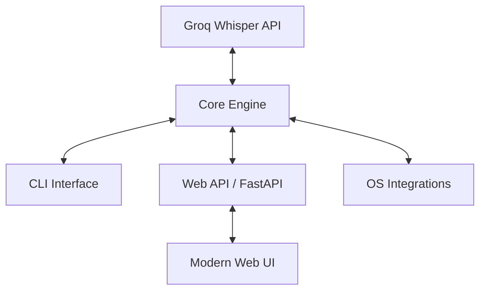

# Code Documentation

## System Architecture

Transcriber follows a **3-tier modular architecture** where a central engine powers multiple user interfaces.

### 1. Core Engine (`src/transcriber/core/`)

The heart of the application. It is completely decoupled from any UI.
- **`engine.py`**: Coordinates the entire process. Validates audio, plans chunks, calls the Groq client, and writes the final `.txt` output.
- **`chunking.py`**: Contains the `ChunkPlanner`. It calculates how to split files into segments if they exceed the `TRANSCRIBER_MAX_UPLOAD_MB` limit.
- **`groq_client.py`**: A specialized wrapper for the Groq API, handling the multipart transcription requests.
- **`audio.py`**: Uses `pydub` to load and export audio segments. It handles the low-level media conversions required for chunking.
- **`models.py`**: Defines the `TranscriptionRequest` and `TranscriptionResult` dataclasses used throughout the app.
- **`settings.py`**: Handles environment variable loading and validation via `.env` files.
- **`logging_utils.py`**: Provides standardized logging configuration for all interfaces.

### 2. Interfaces

- **CLI (`src/transcriber/cli/`)**: A Python-entry-point based tool that provides a colorful, interactive terminal experience. It translates user flags into `TranscriptionRequest` objects.
- **Web (`src/transcriber/web/`)**: A FastAPI server that implements an **Asynchronous Job Pattern**.
    - When a file is uploaded, a background task is spawned.
    - A `JobStore` maintains the state and progress.
    - The frontend polls the status until completion.
    - **Local-First History**: Finished transcripts, alongside generated metadata and preview snippets, are saved to the browser's `localStorage` (via `index.html` scripts). This provides persistent history and bulk-JSON export without requiring an external database.

### 3. Integrations (`integrations/`)

Small, OS-specific "glue" scripts that bridge the gap between the user's file explorer and our CLI.
- **Windows**: Uses Batch files to modify the Registry (`HKCU`) and point context menu actions to a hidden CLI call.
- **Linux**: Nautilus scripts placed in `~/.local/share/nautilus/scripts`.
- **macOS**: shell scripts designed for Automator Quick Actions.

## Key Logic: Chunking & Merging

When a file is too large for a single API call:
1. The `ChunkPlanner` determines the number of segments.
2. `audio.py` exports each segment to a temporary `.mp3` file.
3. The segments are sent to Groq sequentially.
4. The engine collects all text fragments and joins them into a single coherent transcript.
5. Temp files are cleaned up immediately.

## Error Handling

The system is designed with **Structured Resilience**:
- All major operations return a `TranscriptionResult` object rather than raising uncaught exceptions.
- The `status` field (`success` | `failed`) is used by interfaces to decide how to notify the user.
- Errors are logged with full stack traces in `logs/transcriber.log` if enabled.
