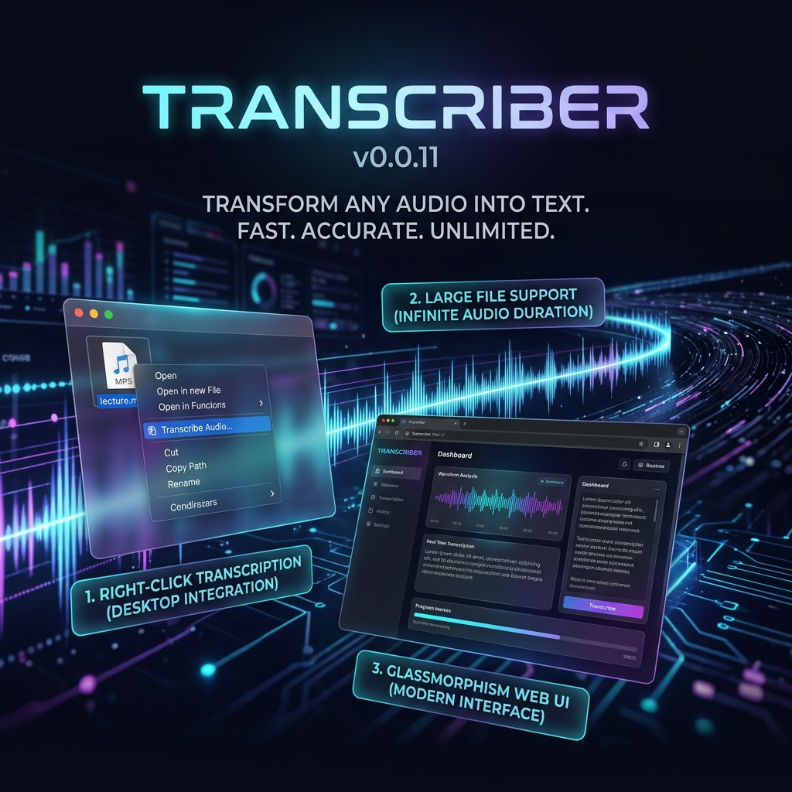

<p align="center">
  
</p>

# Transcriber
[](https://www.gnu.org/licenses/gpl-3.0)

Cross-platform audio transcription app with three interfaces sharing one core engine:

- CLI command (`transcribe`)
- Web app (`FastAPI`, port `3004`)
- OS right-click integrations (Windows, Linux, macOS templates)

## Features

- **🚀 Groq Whisper power**: High-speed transcription using `whisper-large-v3` or `whisper-large-v3-turbo`.
- **🎨 Premium UI**: Modern, dark-themed "glassmorphism" web interface with drag-and-drop, real-time progress, and transcript preview.
- **📜 Local-First History**: Built-in transcription session history saved securely in the browser, featuring single-click recall and bulk JSON exports via native OS dialogs.
- **🌈 Colorful CLI**: Upgraded CLI with ANSI color status tracking and simplified one-command syntax.
- **🖱️ OS-Level Integration**: Right-click transcription for Windows (Registry), Linux (Nautilus), and macOS (Automator).
- **📦 Large File Support**: Automatic chunking and sequential processing for files exceeding API limits.
- **🛡️ Smart Collision Handling**: Automatically creates timestamped copies (e.g., `Psycology_2026.txt`) if a transcript already exists.
- **⚙️ Configurable Logging**: Detailed structured logging with the option to disable disk-writing.

## Requirements

- Python `3.11+`
- Groq API key
- `ffmpeg` (Required for audio chunking and processing)

## Quick Start

### Windows (Easy Launch)
Just double-click [**LaunchTranscriber.bat**](LaunchTranscriber.bat). It will:
- Check for `ffmpeg`.
- Run the setup script to create your virtual environment.
- Create a `.env` template if one is missing (and open it for you).
- Launch the Web UI at http://127.0.0.1:3004.

### Linux/macOS
```bash
bash scripts/setup.sh
chmod +x LaunchTranscriber.sh
./LaunchTranscriber.sh
```

## Configuration

Edit [.env](.env) to customize behavior (these changes apply only to your local user environment):

> **Developer Note:** If you wish to change the baseline architectural defaults for the entire application (rather than just your local override), you must update the `TranscriptionConfig` class inside `src/transcriber/core/models.py`. The application uses `models.py` as the strict single source of truth for all default fallbacks, ensuring a "Don't Repeat Yourself" (DRY) paradigm.

| Variable | Default | Description |
|----------|---------|-------------|
| `GROQ_API_KEY` | (Required) | Your Groq Cloud API key. |
| `TRANSCRIBER_MODEL` | `whisper-large-v3` | Model to use (`turbo` also supported). |
| `TRANSCRIBER_MAX_UPLOAD_MB` | `25` | Ceiling before the engine switches to chunking. |
| `TRANSCRIBER_CHUNK_DURATION_SECONDS` | `600` | Duration (in seconds) of each chunk for large files. |
| `TRANSCRIBER_CHUNK_OVERLAP_SECONDS` | `5` | Overlap in seconds to maintain context between chunks. |
| `TRANSCRIBER_MAX_RETRIES` | `3` | Max retries for failed chunk API transcription calls. |
| `TRANSCRIBER_LOG_FILE` | `logs/transcriber.log` | Path to log file. Set to **`OFF`** to disable. |

## CLI Usage

The CLI is now simple and colorful. Just run:

```bash
transcribe ./audio/sample.mp3
transcribe ./audio/sample.mp3 --model whisper-large-v3-turbo --verbose
transcribe ./audio/sample.mp3 --output ./audio/sample-transcript.txt
transcribe ./audio/sample.mp3 --json
```

## OS Right-Click Integrations

### Windows (Context Menu)
We provide simple batch scripts for hassle-free installation in [integrations/windows/](integrations/windows/):

1.  **Install**: Double-click [**install_context_menu.bat**](integrations/windows/install_context_menu.bat).
2.  **Use**: Right-click any file -> **Show more options** -> **Transcribe Audio**.
3.  **Uninstall**: Double-click [**uninstall_context_menu.bat**](integrations/windows/uninstall_context_menu.bat).

### Linux (Nautilus)
Run the install script:
```bash
bash integrations/linux/install_nautilus_script.sh
```

### macOS (Quick Action)
Follow the guide in [integrations/macos/README.md](integrations/macos/README.md).

## Logging and Observability

Each run logs:

- source file
- timestamp
- model
- duration
- success/failure

Default log file: `logs/transcriber.log`.

## Tests

Run:

```bash
pytest
```

Covered:

- settings loading and validation
- chunk planner behavior
- output collision naming
- engine failure mapping
- CLI success path
- web API job lifecycle

## Future Improvements

- Batch transcription support
- Additional output formats (`.srt`, `.json`)
- Language detection and language hints
- Progress streaming via SSE/WebSocket

## Troubleshooting

- `GROQ_API_KEY is required`: set key in `.env` or shell environment.
- Unsupported format errors: ensure extension is in allowed list and file is valid media.
- Chunking/export failures: install `ffmpeg` and verify it is on `PATH`.
- Overlapping Text Deduplication: The engine overlaps chunks by default (5s) and uses a heuristic to deduplicate overlapping strings in the final text. Highly identical, repeated phrases located precisely at a boundary may result in slight duplications or drops in very rare edge cases.

## Documentation

For more in-depth information, please refer to the specific documentation files:
- 📖 [Code Documentation](CODE_DOCUMENTATION.md) - System architecture and module breakdown
- 🧠 [Design Philosophy](DESIGN_PHILOSOPHY.md) - Core principles and UI aesthetics
- 🤝 [Contributing Guide](CONTRIBUTING.md) - How to report bugs and submit pull requests
- 🚀 [Release Notes](RELEASE_NOTES.md) - Version history and changelog
- 💬 [Social Media](SOCIAL_MEDIA.md) - Project announcements and content
